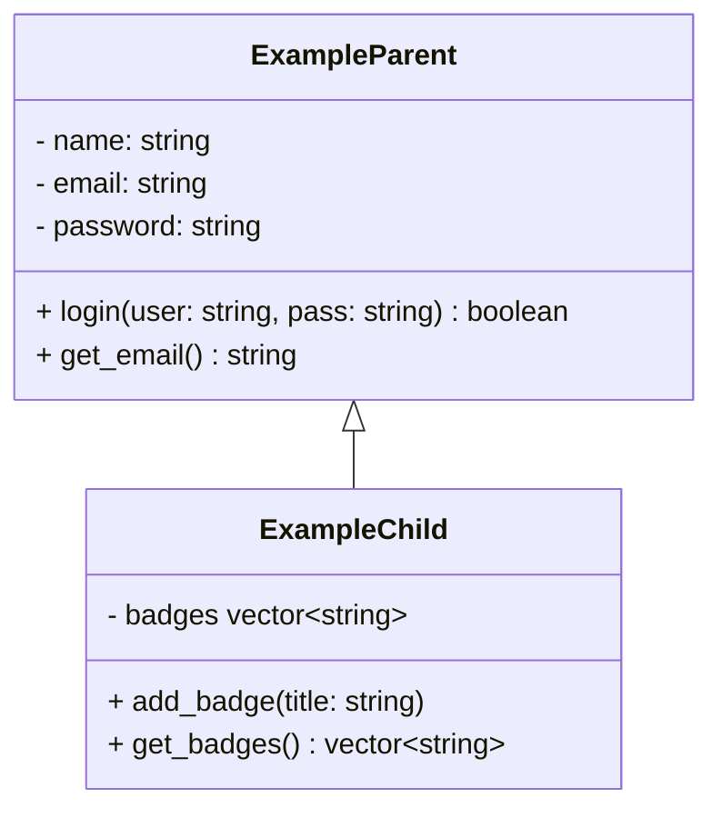

# tippitytappity-design

tippitytappity is a program to practice typing

classDiagram
  User <|-- Player
  Player --> TypingTest

  class User{
        - name: string
        - email: string
        - password: string
        + login(user: string, pass: string) boolean
  }

  class Player{
        - wpm: int
        - accuracy: flaot
        + update_stats(wpm: float, accuracy: float)
        + get_wpm() int
  }

  class TypingTest{
        - target_text: string
        - typed_text: string
        - duration_seconds: int
        + calculate_wpm() int
        + calculate_accuracy() float
  }

## Data model

